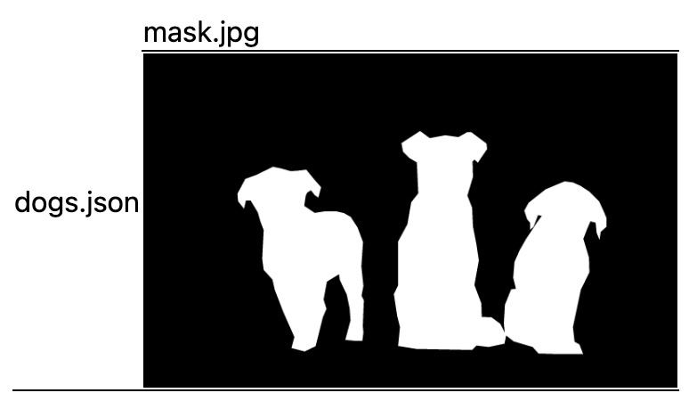

<h1 align="center">
  <br/>Labelme Toolkit
</h1>

<h4 align="center">
  Labelme-compatible Tools for Data Processing
</h4>

<div align="center">
  <a href="https://github.com/labelmeai/labelme"><b>Labelme↗</b></a>
</div>

## Installation

```bash
pip install labelme-toolkit
```

## Usage

```bash
curl -O https://raw.githubusercontent.com/labelmeai/toolkit/main/labelme_toolkit/_data/dogs.json
# or
# wget https://raw.githubusercontent.com/labelmeai/toolkit/main/labelme_toolkit/_data/dogs.json

labelme-toolkit json-to-mask dogs.json --browse
```




## Available tools

```
% labelmetk --help
Usage: labelmetk [OPTIONS] COMMAND [ARGS]...

Options:
  --version   Show the version and exit.
  -h, --help  Show this message and exit.

Commands:
  extract-image          Extract image from a JSON file.
  install-toolkit-pro    Install Toolkit Pro.
  json-to-mask           Convert a Labelme JSON file to a mask.
  json-to-visualization  Convert a Labelme JSON file to a visualization.
  list-labels            List unique labels in the JSON files.
```
